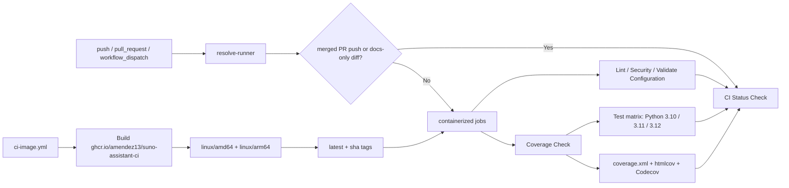

# CI/CD Pipeline Documentation

This document describes the Continuous Integration pipeline for suno-assistant, including the Docker CI image, runner-resolution workflow, the companion secret-scanning workflow, and the local validation path that mirrors GitHub Actions.

## Overview

The CI workflow runs on pushes and pull requests targeting `main` and `develop`. It now uses a shared Docker image for the real checks instead of installing tools independently in every job.

## CI Jobs (`.github/workflows/ci.yml`)

### Runner Resolution

- `resolve-runner` decides which runner labels downstream jobs should use.
- The default target comes from `github_hosted`.
- Manual `workflow_dispatch` runs can override the target with:
  - `github_hosted`
  - `self_hosted_linux`
  - `self_hosted_linux_arm64`
- Downstream jobs use `runs-on: ${{ fromJSON(needs.resolve-runner.outputs.runner) }}`.
- `resolve-runner` also emits `container.options` for self-hosted runs so containerized jobs keep workspace file ownership compatible with the runner user.

### Smart Skip Logic

`resolve-runner` classifies whether the expensive jobs should be skipped before checking out the repository:

- docs-only changes matching `docs/**`, `notes/**`, `README.md`, `AGENTS.md`, or `CLAUDE.md`
- push-to-`main` commits that GitHub already associates with a merged pull request
- merge-commit fallback heuristic when the API association is temporarily unavailable

The aggregate `CI Status Check` job still runs and reports the skip reason, so the skip path is explicit rather than a silent green pass.

### Container Execution Model

All CI jobs except `resolve-runner` execute in the same image:

- `ghcr.io/amendez13/suno-assistant-ci:latest`
- multi-platform manifest: `linux/amd64` and `linux/arm64`
- checkout path isolation via `path: repo`
- `safe.directory` configured in every container job
- no per-job `actions/setup-python`
- Python matrix jobs call preinstalled interpreters directly (`python3.10`, `python3.11`, `python3.12`)

### Failure Short-Circuiting

- workflow concurrency cancels stale pull-request runs on new pushes
- `coverage` runs before the Python matrix, so low coverage fails before the full matrix fan-out
- the Python matrix uses `fail-fast: true`
- each container job requests workflow cancellation via the Actions API if it fails

## Job Summary

### 1. Resolve Runner Target

Purpose: choose the runner labels, container options, CI image reference, and skip mode.

### 2. Lint and Code Quality

Purpose: run black, isort, flake8, and mypy.

Implementation detail:
- uses a pinned lint-only virtual environment so lint versions stay stable even if the shared image tag moves forward

### 3. Coverage Check

Purpose: enforce the `95%` coverage gate and publish the HTML coverage artifact.

### 4. Test Python 3.10 / 3.11 / 3.12

Purpose: run the correctness matrix after the coverage gate passes.

### 5. Security Checks

Purpose: run bandit and pip-audit in the shared CI image.

### 6. Validate Configuration

Purpose: validate YAML configuration and Python syntax.

### 7. CI Status Check

Purpose: aggregate job outcomes and publish the final required status, including intentional skip reasons.

## Companion Security Workflow (`.github/workflows/gitleaks.yml`)

The template also includes a dedicated `Secret Scanning` workflow for repository-level secret detection:

- triggers on `push`, `pull_request`, and `workflow_dispatch`
- checks out the full git history with `fetch-depth: 0`
- installs a pinned `gitleaks` release and verifies its checksum
- generates a redacted SARIF report
- uploads the redacted SARIF artifact on every run
- attempts a best-effort upload to GitHub code scanning when the repository supports SARIF ingestion

This workflow is separate from `ci.yml` because secret scanning has different runtime and reporting needs than the containerized application checks.

## CI Image Workflow (`.github/workflows/ci-image.yml`)

The CI image workflow rebuilds and publishes the shared image when these inputs change:

- `infra/ci/Dockerfile`
- `requirements.txt`
- `.pre-commit-config.yaml`

Published tags:

- `ghcr.io/amendez13/suno-assistant-ci:latest`
- `ghcr.io/amendez13/suno-assistant-ci:<git-sha>`

Published platforms:

- `linux/amd64`
- `linux/arm64`

## Local Validation

### Run the same CI image locally

```bash
docker build -t suno-assistant-ci:test -f infra/ci/Dockerfile .
docker compose -f infra/ci/docker-compose.ci.yml run --rm ci bash
```

Inside the container shell:

```bash
python3.10 --version
python3.11 --version
python3.12 --version
black --version
flake8 --version
mypy --version
pytest --version
python3.12 -m pytest tests/ -v --cov=suno_assistant
```

### Run the repository checks without Docker

```bash
pre-commit run --all-files
pytest tests/ -v --cov=suno_assistant --cov-report=term-missing --cov-fail-under=95
pytest tests/ -v
bandit -r suno_assistant/ -ll
pip-audit --requirement requirements.txt
gitleaks dir . --no-banner --redact=100
gitleaks git . --no-banner --redact=100
```

## Containerized CI Architecture



## Configuration Files

| File | Purpose |
|------|---------|
| `.github/workflows/ci.yml` | Main CI workflow |
| `.github/workflows/ci-image.yml` | CI image build/publish workflow |
| `.github/workflows/gitleaks.yml` | Repository secret-scanning workflow |
| `infra/ci/Dockerfile` | Shared CI image definition |
| `infra/ci/docker-compose.ci.yml` | Local container shell matching CI |
| `infra/ci/build-and-push.sh` | Manual multi-arch build/push helper |
| `docs/CI_RUNNER.md` | Self-hosted runner operations guidance |
| `docs/SECURITY_BASELINE.md` | Secret scanning and GitHub security baseline |
| `.pre-commit-config.yaml` | Local pre-commit checks |
| `pyproject.toml` | Tool configurations |
